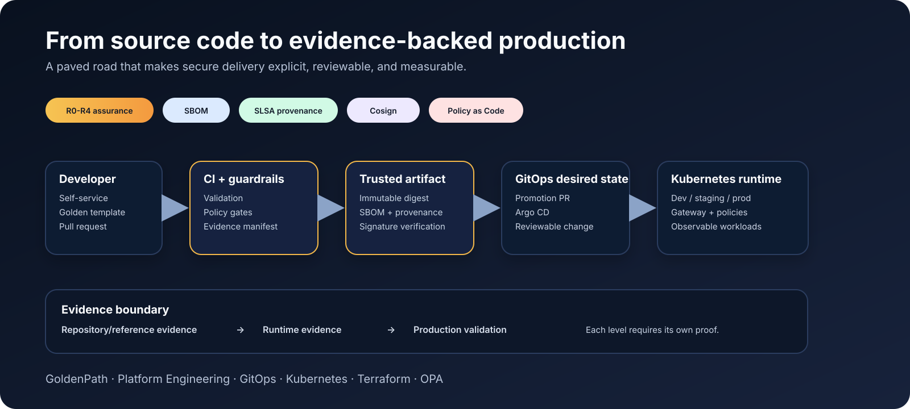
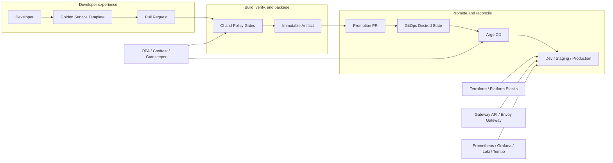

<p align="center"></p>

<h3 align="center">The paved road from source code to evidence-backed production.</h3>

<p align="center">
  <strong>An evidence-driven, risk-adaptive Golden Path for secure self-service delivery on Kubernetes.</strong>
</p>

<p align="center">
  Platform Engineering · Kubernetes · GitOps · Terraform · Policy as Code · Software Supply Chain
</p>

<p align="center">
  <a href="https://github.com/lloga29/goldenPath/actions/workflows/repository-validation.yaml"></a>
  <a href="https://github.com/lloga29/goldenPath/releases/latest"></a>
  <a href="LICENSE"></a>
</p>

<p align="center">
  <a href="https://lloga29.github.io/goldenPath/">Website</a> ·
  <a href="docs/DEMO.md">Demo</a> ·
  <a href="docs/showcases/evidence-backed-delivery.md">Showcase</a> ·
  <a href="docs/insights/README.md">Insights</a> ·
  <a href="docs/QUICKSTART.md">Quickstart</a> ·
  <a href="docs/architecture/overview.md">Architecture</a> ·
  <a href="docs/assurance/">Assurance</a> ·
  <a href="SECURITY.md">Security</a> ·
  <a href="docs/roadmap.md">Roadmap</a> ·
  <a href="CONTRIBUTING.md">Contributing</a>
</p>

<p align="center">
  
</p>

## Why GoldenPath is different

| Risk-adaptive assurance | Evidence-bound controls | Supply-chain trust | Governed GitOps |
|---|---|---|---|
| R0-R4 assurance changes required controls according to deterministic risk inputs. | Architecture, policy, and desired-state evidence is bound to authoritative inputs instead of self-declared status. | The implemented Go path validates SBOM attestations, SLSA provenance, immutable digests, and keyless signatures. | Promotion is explicit, reviewable, and separated from runtime or production claims. |

GoldenPath deliberately distinguishes **repository/reference evidence**, **runtime evidence**, and **production validation**. A green manifest, workflow, or rendered chart is never presented as proof that a real cloud account, cluster, registry, DNS zone, or secret backend is operational.

## GoldenPath in 60 seconds

Run the zero-cloud assurance demo. It requires only Bash and Python 3:

```bash
git clone https://github.com/lloga29/goldenPath.git
cd goldenPath
./scripts/demo.sh
```

The demo derives an R0-R4 assurance plan, validates evidence bound to that plan, and then proves fail-closed behavior by showing that incomplete required-gate evidence is rejected.

This is **repository/reference evidence only**. It does not claim that a registry, cloud account, Kubernetes cluster, GitOps controller, or production workload was exercised.

See the [demo walkthrough](docs/DEMO.md) for what each step proves, or continue with the [15-minute quickstart](docs/QUICKSTART.md) for the broader paved road.

## End-to-end repository showcase

For a single narrative that connects risk-adaptive assurance to governed GitOps promotion, run:

```bash
./scripts/showcase-delivery.sh
```

The showcase derives an R0-R4 plan, validates evidence bound to that plan, proves incomplete evidence is rejected, and then exercises the digest-bound promotion contract through `dev -> staging -> prod`. The promotion harness also proves that tag-based input, digest mismatches, and failed trust verification are rejected before desired state is mutated.

This remains **repository/reference evidence only**. The promotion stage uses isolated fake `yq` and `cosign` executables so the contract can be demonstrated without claiming a live registry, signature transparency service, Argo CD control plane, Kubernetes cluster, or production workload.

See the [end-to-end showcase walkthrough](docs/showcases/evidence-backed-delivery.md) for the evidence map and runtime-validation boundary.

For reusable explanations of the core engineering ideas, read the [GoldenPath technical insight series](docs/insights/README.md).

GoldenPath is an evidence-driven **Golden Path reference implementation** for internal developer platforms. It connects developer experience, reusable service templates, CI and policy gates, immutable artifacts, GitOps promotion, Kubernetes runtime, infrastructure as code, observability, governance, and operational practices into one explicit delivery path.

Its purpose is to make the safe and repeatable path the easiest path for engineering teams without hiding the platform decisions, controls, or runtime responsibilities underneath it.

> **Core idea:** GoldenPath is not a monolithic platform product or a collection of disconnected manifests. It is a reference architecture and implementation baseline that shows how platform teams can standardize software delivery while keeping security, governance, observability, and operational ownership explicit.

## Who is this for?

GoldenPath is designed for:

- Platform Engineering teams building or evolving internal developer platforms;
- DevOps and SRE teams standardizing Kubernetes delivery and operational controls;
- organizations adopting GitOps, policy as code, and reusable infrastructure patterns;
- engineering teams that want a documented, auditable paved road without hiding the underlying platform decisions.

## Project status

GoldenPath is an actively developed reference implementation. The repository currently includes the core platform baseline for CI validation, GitOps delivery with Argo CD, reusable Terraform modules, policy as code, operational documentation, and a working Go service template.

**Implemented today:** repository validation, Terraform platform modules, Kubernetes/GitOps baseline, policy controls, observability baseline, runbooks, ADRs, and the Go golden service template.

**On the roadmap:** additional service templates, including Python, and a dedicated Terraform stack template.

See [Current implementation](#current-implementation) for the evidence-backed capability matrix.

## Quick start

The fastest way to exercise the paved road is to generate and validate the implemented Go service template:

```bash
git clone https://github.com/lloga29/goldenPath.git
cd goldenPath

copier copy ./service-templates/templates/microservice-golang ./my-service
cd my-service

go test ./...
go vet ./...
```

Continue with the full [15-minute quickstart](docs/QUICKSTART.md) for Terraform validation, GitOps registration, immutable promotion, and runtime checks.

## Platform capabilities

This repository demonstrates an end-to-end Platform Engineering approach rather than a collection of isolated manifests. The implementation is intentionally evidence-driven: capabilities are described as implemented, reference, roadmap, or runtime-dependent according to what the repository can actually prove.

| Engineering area | What the repository demonstrates | Evidence |
|---|---|---|
| Platform Engineering | A reusable paved-road model with service templates, environment conventions, governance, and operational documentation | `service-templates/`, `docs/`, `platform-stacks/` |
| Kubernetes and GitOps | Argo CD as the authoritative reconciler, ApplicationSets/AppProjects, Kustomize overlays, explicit environment promotion, and manual production synchronization | `gitops-config/`, `docs/architecture/`, `docs/operations/` |
| Infrastructure as Code | Reusable Terraform modules, executable reference stacks, validation, testing, and cloud-provider abstractions | `terraform-modules/`, `platform-stacks/` |
| Policy as code | OPA/Conftest controls, Gatekeeper examples, negative/positive fixtures, and governed policy exceptions | `platform-policies/`, `gitops-config/policies/` |
| CI/CD engineering | Root validation with changed-domain detection, pinned toolchains, build/test gates, and reviewable promotion semantics | `.github/workflows/`, `scripts/` |
| Software supply chain | SHA-pinned external Actions, checksum-verified executable downloads, hash-locked Python tooling, immutable artifact expectations, and provenance-aware service templates | `.github/workflows/`, `.github/requirements/`, `service-templates/` |
| Observability | A reference platform baseline for Prometheus, Grafana, Loki, and Tempo integrated into the GitOps model | `gitops-config/platform/values/`, `gitops-config/argocd/applicationsets/` |
| Operational discipline | Runbooks, ADRs, security guidance, support expectations, rollback procedures, audit checklist, and maturity model | `docs/runbooks/`, `docs/adr/`, `SECURITY.md`, `AUDIT_CHECKLIST.md` |

Start with the [15-minute quickstart](docs/QUICKSTART.md), the [architecture overview](docs/architecture/overview.md), and the [audit checklist](AUDIT_CHECKLIST.md). The audit checklist is deliberately conservative: static CI or desired-state configuration is never presented as proof that an external cloud account, cluster, DNS zone, certificate authority, or secret backend is operational.

## Architecture at a glance



The reference platform declares Argo CD-native Helm configuration for Envoy Gateway, cert-manager, External Secrets, Prometheus stack, Loki, Tempo, and Gatekeeper. Root CI renders every pinned platform chart for development, staging, and production values before merge. Actual cloud credentials, registries, DNS, secret backends, environment Gateways, certificate issuers, load-balancer behavior, and real cluster endpoints remain environment-specific responsibilities and must not be fabricated in shared desired state.

> **Repository model:** this is a consolidated reference repository. Several directories are designed to become independent repositories in a production organization. Workflows stored under nested `.github/workflows` directories are reference workflows for those future repositories; GitHub Actions only executes workflows from the repository-root `.github/workflows` directory.

## Principles

- **Paved roads, not walls** — make the recommended path easier than the unsafe path.
- **Secure by default** — identity, encryption, least privilege, policy enforcement, and auditable change are platform defaults.
- **Build once, promote** — promote immutable artifacts between environments instead of rebuilding them.
- **Everything as code** — infrastructure, policy, application configuration, runbooks, and architecture decisions live in version control.
- **GitOps reconciliation** — Git is the source of desired state and Argo CD is the authoritative Kubernetes reconciler in this baseline.
- **Self-service with guardrails** — teams should not require platform tickets for routine delivery.
- **Observable by default** — metrics, logs, traces, health signals, and ownership metadata are part of the service contract.
- **Measure and improve** — DORA metrics, SLOs, adoption, and platform reliability inform the roadmap.

## Current implementation

| Capability | Status | Repository evidence |
|---|---|---|
| Root repository validation | Implemented | `.github/workflows/repository-validation.yaml` |
| Terraform reusable modules | Implemented baseline | `terraform-modules/` |
| AWS/Azure/GCP network abstraction | Implemented reference | `terraform-modules/modules/networking/vpc/` |
| Object storage abstraction | Implemented reference | `terraform-modules/modules/storage/object-storage/` |
| AWS IAM role and GitHub OIDC modules | Implemented reference | `terraform-modules/modules/security/` |
| Client/environment infrastructure stacks | Implemented reference | `platform-stacks/` |
| Argo CD ApplicationSets and Projects | Implemented reference | `gitops-config/argocd/` |
| Kustomize application overlays | Implemented reference | `gitops-config/apps/` |
| Kubernetes platform add-ons | Implemented reference | `gitops-config/platform/values/` and `gitops-config/argocd/applicationsets/` |
| Gateway API controller baseline | Implemented reference | Envoy Gateway in `gitops-config/argocd/applicationsets/platform-apps.yaml` |
| Platform GatewayClass | Implemented reference | `gitops-config/platform/resources/gateway-class.yaml` |
| Policy as code | Implemented baseline | `platform-policies/` and `gitops-config/policies/` |
| Go service template | Implemented and smoke-tested | `service-templates/templates/microservice-golang/` |
| Python service template | Roadmap | Not present in the repository yet |
| Terraform stack template | Roadmap | Not present in the repository yet |
| Operational runbooks | Implemented and expanding | `docs/runbooks/` and `docs/operations/` |
| Platform product documentation | Implemented in this documentation set | `docs/` |

## Repository layout

```text
goldenPath/
├── .github/workflows/           # Active consolidated-repository validation
├── docs/                        # Platform product, architecture, operations, and runbooks
├── terraform-modules/           # Reusable Terraform modules and module standards
├── platform-stacks/             # Client, foundation, environment, and ephemeral stacks
├── gitops-config/               # Argo CD, Helm values, Kustomize, platform resources, app delivery
├── platform-policies/           # OPA/Conftest policies and exception model
├── service-templates/           # Golden service templates; Go is implemented today
├── CONTRIBUTING.md              # Contribution and review rules
├── SECURITY.md                  # Security reporting and platform security expectations
└── SUPPORT.md                   # Support and escalation model
```

## Environment model

| Environment | Intended use | Reconciliation posture | Promotion expectation |
|---|---|---|---|
| `dev` | Fast integration feedback | Automated; pruning enabled for the reference platform | Automatic or low-friction |
| `staging` | Production-like validation | Automated; pruning disabled by default | Explicit promotion |
| `prod` | Customer/business workloads | Manual Argo CD sync in the reference model | Approval and auditable promotion |
| `ephemeral` | Pull-request previews | Disposable | TTL-based lifecycle |

Production approval enforcement must also be configured in the hosting GitHub organization, Argo CD, and cloud/Kubernetes environments. A manifest alone is not evidence that those external controls exist.

## Technology baseline

The reference implementation uses or documents:

- Terraform and cloud providers for AWS, Azure, and GCP
- Kubernetes, Kustomize, Helm, and Gateway API
- Argo CD ApplicationSets and AppProjects
- Envoy Gateway as the reference Gateway API controller
- GitHub Actions and OIDC federation
- Copier service templates
- Go for the implemented service template
- OPA, Conftest, and Gatekeeper
- cert-manager and External Secrets Operator
- Prometheus, Grafana, Loki, and Tempo
- Checkov, tfsec, and Infracost as reference/optional integrations where documented

The former ingress-nginx baseline is retired. Migration guidance is in [docs/operations/ingress-nginx-to-gateway-api.md](docs/operations/ingress-nginx-to-gateway-api.md). Platform dependency upgrades remain explicit and reviewable, with maintained chart baselines and migration notes validated as repository/reference evidence rather than hidden inside structural changes.

## Validation contract

Every pull request runs an always-on baseline that validates repository language conventions, YAML/JSON parsing, and shell syntax. Changed-domain detection activates deeper checks for documentation, Terraform, GitOps/policy, and service templates. Changes to the root validation workflow or root validation scripts force all domains to run so CI changes test themselves.

The GitOps validation contract additionally checks:

- the exact Argo CD platform component/environment matrix;
- explicit AppProject source allowlists;
- production manual-sync semantics;
- absence of active Flux APIs, `flux-system`, deprecated `commonLabels`, and ingress-nginx as a platform component;
- Kustomize rendering;
- Helm rendering of every platform component in every environment;
- Conftest positive/negative policy fixtures and policy-exception registry validity.

Passing static validation does **not** prove a real cluster, cloud account, DNS zone, certificate authority, or secret backend has been configured. Runtime claims require runtime evidence.

## Start here

1. Read the [15-minute quickstart](docs/QUICKSTART.md).
2. Read the [architecture overview](docs/architecture/overview.md).
3. Review the [implementation guide](golden-path-implementation-guide.md).
4. Review the [security model](docs/security/security-model.md) before production adoption.
5. Use the [audit checklist](AUDIT_CHECKLIST.md) and [maturity model](docs/maturity-model.md) to identify remaining evidence gaps.

## Production adoption rule

Nothing in this repository should be considered production-enabled merely because a manifest or workflow exists. A capability is production-ready only after it is integrated with real identity, secrets, cloud accounts, clusters, registries, DNS, observability, alerting, ownership, backup/recovery, and organization-level protection rules, and after those controls have been validated in the target environment.

## License

Licensed under the [Apache License 2.0](LICENSE). The license permits use, modification, and distribution subject to its terms and preserves the patent grant and attribution obligations defined by Apache-2.0.

## Ownership

Repository owner and commit identity: **Juan Gallo <lloga29@gmail.com>**.

Repository documentation and contributions use English as the working language, and CI enforces that repository convention. Significant platform decisions should be recorded as ADRs, and operationally significant controls should have both documentation and validation evidence.
