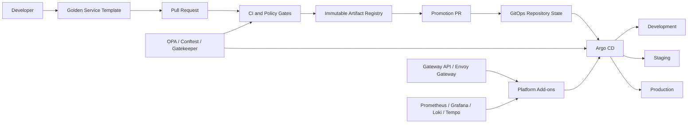

# Golden Path

A production-oriented **Golden Path reference implementation** for internal developer platforms.

This repository brings together reusable Terraform modules, client and environment stacks, GitOps configuration, Kubernetes platform components, policy-as-code guardrails, service templates, active repository validation, and operational documentation. Its purpose is to provide a paved road that teams can adopt and adapt without hiding the underlying platform decisions.

> **Repository model:** this is a consolidated reference repository. Several directories are designed to become independent repositories in a production organization. Workflows stored under nested `.github/workflows` directories are reference workflows for those future repositories; GitHub Actions only executes workflows from the repository-root `.github/workflows` directory.

## Principles

- **Paved roads, not walls** — make the recommended path easier than the unsafe path.
- **Secure by default** — identity, encryption, least privilege, policy enforcement, and auditable change are platform defaults.
- **Build once, promote** — promote immutable artifacts between environments instead of rebuilding them.
- **Everything as code** — infrastructure, policy, application configuration, runbooks, and architecture decisions live in version control.
- **GitOps reconciliation** — Git is the source of desired state and Argo CD is the authoritative Kubernetes reconciler in this baseline.
- **Self-service with guardrails** — teams should not require platform tickets for routine delivery.
- **Observable by default** — metrics, logs, traces, health signals, and ownership metadata are part of the service contract.
- **Measure and improve** — DORA metrics, SLOs, adoption, and platform reliability inform the roadmap.

## Current implementation

| Capability | Status | Repository evidence |
|---|---|---|
| Root repository validation | Implemented | `.github/workflows/repository-validation.yaml` |
| Terraform reusable modules | Implemented baseline | `terraform-modules/` |
| AWS/Azure/GCP network abstraction | Implemented reference | `terraform-modules/modules/networking/vpc/` |
| Object storage abstraction | Implemented reference | `terraform-modules/modules/storage/object-storage/` |
| AWS IAM role and GitHub OIDC modules | Implemented reference | `terraform-modules/modules/security/` |
| Client/environment infrastructure stacks | Implemented reference | `platform-stacks/` |
| Argo CD ApplicationSets and Projects | Implemented reference | `gitops-config/argocd/` |
| Kustomize application overlays | Implemented reference | `gitops-config/apps/` |
| Kubernetes platform add-ons | Implemented reference | `gitops-config/platform/values/` and `gitops-config/argocd/applicationsets/` |
| Gateway API controller baseline | Implemented reference | Envoy Gateway in `gitops-config/argocd/applicationsets/platform-apps.yaml` |
| Platform GatewayClass | Implemented reference | `gitops-config/platform/resources/gateway-class.yaml` |
| Policy as code | Implemented baseline | `platform-policies/` and `gitops-config/policies/` |
| Go service template | Implemented and smoke-tested | `service-templates/templates/microservice-golang/` |
| Python service template | Roadmap | Not present in the repository yet |
| Terraform stack template | Roadmap | Not present in the repository yet |
| Operational runbooks | Implemented and expanding | `docs/runbooks/` and `docs/operations/` |
| Platform product documentation | Implemented in this documentation set | `docs/` |

## Architecture



The reference platform declares Argo CD-native Helm configuration for Envoy Gateway, cert-manager, External Secrets, Prometheus stack, Loki, Tempo, and Gatekeeper. Root CI renders every pinned platform chart for development, staging, and production values before merge. Actual cloud credentials, registries, DNS, secret backends, environment Gateways, certificate issuers, load-balancer behavior, and real cluster endpoints remain environment-specific responsibilities and must not be fabricated in shared desired state.

## Repository layout

```text
goldenPath/
├── .github/workflows/           # Active consolidated-repository validation
├── docs/                        # Platform product, architecture, operations, and runbooks
├── terraform-modules/           # Reusable Terraform modules and module standards
├── platform-stacks/             # Client, foundation, environment, and ephemeral stacks
├── gitops-config/               # Argo CD, Helm values, Kustomize, platform resources, app delivery
├── platform-policies/           # OPA/Conftest policies and exception model
├── service-templates/           # Golden service templates; Go is implemented today
├── CONTRIBUTING.md              # Contribution and review rules
├── SECURITY.md                  # Security reporting and platform security expectations
└── SUPPORT.md                   # Support and escalation model
```

## Environment model

| Environment | Intended use | Reconciliation posture | Promotion expectation |
|---|---|---|---|
| `dev` | Fast integration feedback | Automated; pruning enabled for the reference platform | Automatic or low-friction |
| `staging` | Production-like validation | Automated; pruning disabled by default | Explicit promotion |
| `prod` | Customer/business workloads | Manual Argo CD sync in the reference model | Approval and auditable promotion |
| `ephemeral` | Pull-request previews | Disposable | TTL-based lifecycle |

Production approval enforcement must also be configured in the hosting GitHub organization, Argo CD, and cloud/Kubernetes environments. A manifest alone is not evidence that those external controls exist.

## Technology baseline

The reference implementation uses or documents:

- Terraform and cloud providers for AWS, Azure, and GCP
- Kubernetes, Kustomize, Helm, and Gateway API
- Argo CD ApplicationSets and AppProjects
- Envoy Gateway as the reference Gateway API controller
- GitHub Actions and OIDC federation
- Copier service templates
- Go for the implemented service template
- OPA, Conftest, and Gatekeeper
- cert-manager and External Secrets Operator
- Prometheus, Grafana, Loki, and Tempo
- Checkov, tfsec, and Infracost as reference/optional integrations where documented

The former ingress-nginx baseline is retired. Migration guidance is in [docs/operations/ingress-nginx-to-gateway-api.md](docs/operations/ingress-nginx-to-gateway-api.md). Platform dependency refresh work is tracked separately so chart upgrades remain explicit and reviewable rather than being hidden inside structural changes.

## Validation contract

Every pull request runs an always-on baseline that checks English-only content, YAML/JSON parsing, and shell syntax. Changed-domain detection activates deeper checks for documentation, Terraform, GitOps/policy, and service templates. Changes to the root validation workflow or root validation scripts force all domains to run so CI changes test themselves.

The GitOps validation contract additionally checks:

- the exact Argo CD platform component/environment matrix;
- explicit AppProject source allowlists;
- production manual-sync semantics;
- absence of active Flux APIs, `flux-system`, deprecated `commonLabels`, and ingress-nginx as a platform component;
- Kustomize rendering;
- Helm rendering of every platform component in every environment;
- Conftest positive/negative policy fixtures and policy-exception registry validity.

Passing static validation does **not** prove a real cluster, cloud account, DNS zone, certificate authority, or secret backend has been configured. Runtime claims require runtime evidence.

## Start here

1. Read the [15-minute quickstart](docs/QUICKSTART.md).
2. Read the [architecture overview](docs/architecture/overview.md).
3. Review the [implementation guide](golden-path-implementation-guide.md).
4. Review the [security model](docs/security/security-model.md) before production adoption.
5. Use the [audit checklist](AUDIT_CHECKLIST.md) and [maturity model](docs/maturity-model.md) to identify remaining evidence gaps.

## Production adoption rule

Nothing in this repository should be considered production-enabled merely because a manifest or workflow exists. A capability is production-ready only after it is integrated with real identity, secrets, cloud accounts, clusters, registries, DNS, observability, alerting, ownership, backup/recovery, and organization-level protection rules, and after those controls have been validated in the target environment.

## Ownership

Repository owner and commit identity: **Juan Gallo <lloga29@gmail.com>**.

All new repository content is written in English. Significant platform decisions should be recorded as ADRs, and operationally significant controls should have both documentation and validation evidence.
