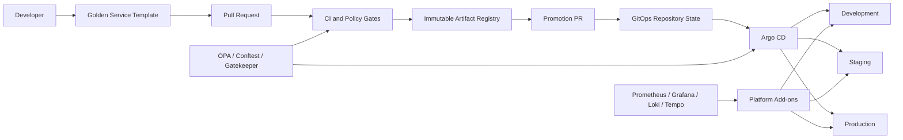

# Golden Path

A production-oriented **Golden Path reference implementation** for internal developer platforms.

This repository brings together reusable Terraform modules, client and environment stacks, GitOps configuration, Kubernetes platform components, policy-as-code guardrails, service templates, and operational documentation. Its purpose is to provide a paved road that teams can adopt and adapt without hiding the underlying platform decisions.

> **Repository model:** this is a consolidated reference repository. Several directories are designed to become independent repositories in a production organization. Workflows stored under nested `.github/workflows` directories are reference workflows for those future repositories; GitHub Actions only executes workflows from the repository-root `.github/workflows` directory.

## Principles

- **Paved roads, not walls** — make the recommended path easier than the unsafe path.
- **Secure by default** — identity, encryption, least privilege, policy enforcement, and auditable change are platform defaults.
- **Build once, promote** — promote immutable artifacts between environments instead of rebuilding them.
- **Everything as code** — infrastructure, policy, application configuration, runbooks, and architecture decisions live in version control.
- **GitOps reconciliation** — Git is the source of desired state for Kubernetes delivery.
- **Self-service with guardrails** — teams should not require platform tickets for routine delivery.
- **Observable by default** — metrics, logs, traces, health signals, and ownership metadata are part of the service contract.
- **Measure and improve** — DORA metrics, SLOs, adoption, and platform reliability inform the roadmap.

## Current implementation

| Capability | Status | Repository evidence |
|---|---|---|
| Terraform reusable modules | Implemented baseline | `terraform-modules/` |
| AWS/Azure/GCP network abstraction | Implemented reference | `terraform-modules/modules/networking/vpc/` |
| Object storage abstraction | Implemented reference | `terraform-modules/modules/storage/object-storage/` |
| AWS IAM role and GitHub OIDC modules | Implemented reference | `terraform-modules/modules/security/` |
| Client/environment infrastructure stacks | Implemented reference | `platform-stacks/` |
| Argo CD ApplicationSets and Projects | Implemented reference | `gitops-config/argocd/` |
| Kustomize application overlays | Implemented reference | `gitops-config/apps/` |
| Kubernetes platform add-ons | Implemented reference | `gitops-config/platform/base/` |
| Policy as code | Implemented baseline | `platform-policies/` and `gitops-config/policies/` |
| Go service template | Implemented | `service-templates/templates/microservice-golang/` |
| Python service template | Roadmap | Not present in the repository yet |
| Terraform stack template | Roadmap | Not present in the repository yet |
| Operational runbooks | Implemented and expanding | `docs/runbooks/` |
| Platform product documentation | Implemented in this documentation set | `docs/` |

## Architecture



The reference platform includes configuration for ingress-nginx, cert-manager, External Secrets, Prometheus stack, Loki, Tempo, and Gatekeeper. Actual installation, cloud credentials, registries, DNS, secret stores, and cluster endpoints remain environment-specific responsibilities.

## Repository layout

```text
goldenPath/
├── docs/                       # Platform product, architecture, operations, and runbooks
├── terraform-modules/          # Reusable Terraform modules and module standards
├── platform-stacks/            # Client, foundation, environment, and ephemeral stacks
├── gitops-config/              # Argo CD, Kustomize, platform add-ons, and app delivery
├── platform-policies/          # OPA/Conftest policies and exception model
├── service-templates/          # Golden service templates; Go is implemented today
├── CONTRIBUTING.md             # Contribution and review rules
├── SECURITY.md                 # Security reporting and platform security expectations
└── SUPPORT.md                  # Support and escalation model
```

## Environment model

| Environment | Intended use | Reconciliation posture | Promotion expectation |
|---|---|---|---|
| `dev` | Fast integration feedback | Automated | Automatic or low-friction |
| `staging` | Production-like validation | Automated with stronger gates | Explicit promotion |
| `prod` | Customer/business workloads | Controlled | Approval and auditable promotion |
| `ephemeral` | Pull-request previews | Disposable | TTL-based lifecycle |

The repository contains reference Argo CD configuration for these environments. Production approval enforcement must be configured in the hosting GitHub organization, Argo CD, and cloud/Kubernetes environments.

## Technology baseline

The reference implementation uses or documents:

- Terraform and cloud providers for AWS, Azure, and GCP
- Kubernetes and Kustomize
- Argo CD ApplicationSets and AppProjects
- GitHub Actions and OIDC federation
- Copier service templates
- Go for the implemented service template
- OPA, Conftest, and Gatekeeper
- Checkov and tfsec reference checks
- ingress-nginx and cert-manager
- External Secrets Operator
- Prometheus, Grafana, Loki, and Tempo
- Infracost as an optional cost-feedback integration

## Start here

1. Read the [15-minute quickstart](docs/QUICKSTART.md).
2. Read the [architecture overview](docs/architecture/overview.md).
3. Review the [implementation guide](golden-path-implementation-guide.md).
4. Review the [security model](docs/security/security-model.md) before production adoption.
5. Use the [maturity model](docs/maturity-model.md) to identify the next platform capabilities to operationalize.

## Production adoption rule

Nothing in this repository should be considered production-enabled merely because a manifest or workflow exists. A capability is production-ready only after it is integrated with real identity, secrets, cloud accounts, clusters, registries, DNS, observability, alerting, ownership, backup/recovery, and organization-level protection rules, and after those controls have been validated in the target environment.

## Ownership

Repository owner and commit identity: **Juan Gallo <lloga29@gmail.com>**.

All new repository content is written in English. Significant platform decisions should be recorded as ADRs, and operationally significant controls should have both documentation and validation evidence.
