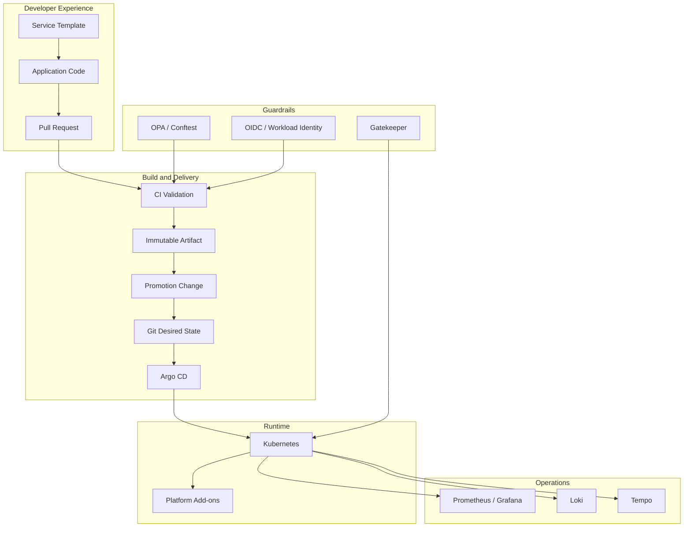

# Architecture Overview

Golden Path is a reference architecture for an internal developer platform that standardizes how services are created, validated, provisioned, promoted, deployed, observed, governed, and recovered.

## Architectural boundaries

The platform is divided into five logical concerns:

1. **Developer experience** — templates, local validation, service metadata, pull requests, and documentation.
2. **Infrastructure** — reusable Terraform modules and client/environment stacks.
3. **Delivery** — immutable artifacts, GitOps desired state, Argo CD reconciliation, and environment promotion.
4. **Guardrails** — policy-as-code, identity controls, approval boundaries, and security checks.
5. **Operations** — observability, SLOs, incident response, rollback, recovery, capacity, and cost.

## Source-of-truth model

| State | Intended source of truth |
|---|---|
| Terraform configuration | Git |
| Terraform runtime state | Secured remote backend |
| Kubernetes desired state | GitOps configuration in Git |
| Kubernetes runtime state | Cluster, reconciled by Argo CD |
| Platform policy | Git |
| Service template | Git and template version |
| Secrets | External secret manager, not Git |
| Build artifacts | Immutable registry |
| Operational telemetry | Observability backends |
| Architecture decisions | ADRs in Git |

## Control flow

A healthy Golden Path minimizes direct runtime mutation. Developers change code or desired state through reviewed Git changes. CI validates the change. Immutable artifacts are published once. Promotion updates environment-specific desired state. Argo CD reconciles clusters. Runtime admission controls provide a second enforcement layer for policies that must not be bypassed.

## Multi-client model

`platform-stacks/clients/` demonstrates isolation by client with separate bootstrap, foundation, and environment layers. This is a reference structure; real client isolation must also exist at the cloud account/subscription/project, identity, network, secret, state, and cluster boundaries as required by the engagement.

## Shared responsibility

The Golden Path supplies patterns and guardrails. Product teams remain responsible for application correctness, domain-specific security, business SLOs, data classification, migrations, and service-specific runbooks. The platform team owns the paved road, shared runtime capabilities, standardized policy, and platform reliability.

## Architecture quality attributes

The platform should be evaluated against:

- reproducibility;
- auditability;
- least privilege;
- tenant/environment isolation;
- deployment safety;
- developer lead time;
- recoverability;
- observability;
- cost transparency;
- upgradeability;
- policy consistency;
- portability without pretending all cloud services are identical.
