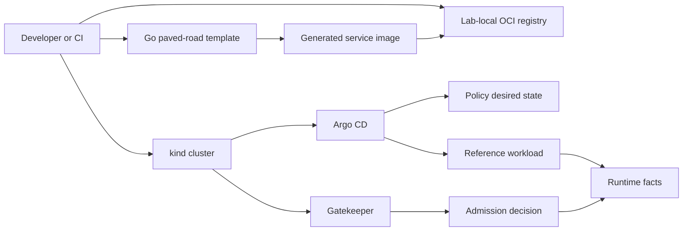

# GoldenPath Runtime Lab

GoldenPath v0.2 P1 introduces a reproducible disposable Runtime Lab backed by kind. The lab exists to move selected assurance checks from repository fixtures to a real Kubernetes API while preserving the evidence boundary established by P0.

## Architecture



The lab uses the bootstrap boundary accepted in ADR-0011. kind, Gatekeeper, and Argo CD are bootstrap dependencies. After bootstrap, Argo CD reconciles the repository policy bundle and the reference workload from the exact source revision. The workload Application also carries the exact generated OCI digest as an explicit Kustomize image override.

## Lifecycle

Run the complete lifecycle with:

```bash
./runtime-lab/lab.sh smoke
```

The command fails closed when cluster creation, bootstrap, template rendering, image publication, reconciliation, admission denial, digest verification, runtime observation, teardown, or residue verification fails.

For CI, `.github/workflows/runtime-lab.yaml` runs the same command on the PR head revision. The workflow is intentionally separate from repository/reference validation because a successful render is not a substitute for a successful live runtime.

## Evidence boundary

The lab emits `goldenpath.runtime-lab-facts/v1` raw facts. They are runtime evidence from an `ephemeral-lab` execution and explicitly record `productionValidation: NOT_CLAIMED`.

The P1 lifecycle itself still emits raw facts rather than silently treating them as a receipt. P2 consumes those facts only after teardown, derives the identity-bound `goldenpath.runtime-evidence/v1` object, signs a `goldenpath.assurance-receipt/v1`, and verifies it independently with an external public trust key. See [Runtime Evidence and Signed Assurance Receipts](../assurance/runtime-signed-receipts.md).

## Determinism and isolation

The supported baseline pins the kind release/node image, Argo CD release, Gatekeeper chart, and local registry version. The CI job additionally checksum-verifies downloaded kind and Helm binaries.

Each execution isolates names for the kind cluster, registry, namespace, and Argo CD Applications. Timeouts are bounded by `GOLDENPATH_LAB_TIMEOUT_SECONDS`. The default is 420 seconds for each bounded wait.

The generated reference service comes from `service-templates/templates/microservice-golang`; P1 does not maintain a second application implementation for the lab.

## Positive and negative paths

The positive path requires the Argo CD workload Application to become Synced/Healthy and the generated workload to become Ready.

The negative path submits a privileged Pod using server-side dry-run. The run only passes when the Kubernetes API rejects the request and the denial identifies the repository-owned `deny-privileged-containers` Gatekeeper constraint.

## Cleanup contract

The successful path deletes the kind cluster and local registry and then proves both names are absent. The EXIT trap attempts the same cleanup after failures. Expected cleanup residue changes the run outcome to failure.

## Claims

A successful Runtime Lab run supports runtime claims only for the identified ephemeral execution. It does not support production claims, managed-cloud equivalence, production SLOs, real organizational approvals, production identity, or compliance certification.
